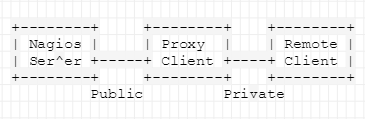
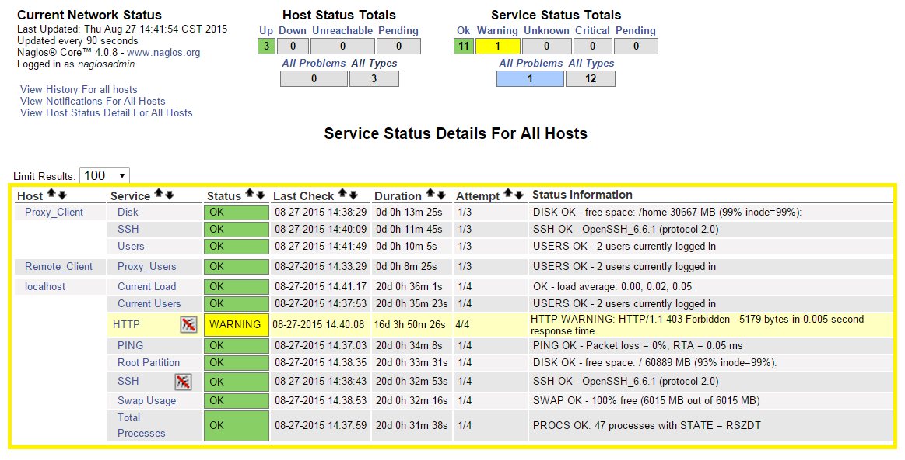

# Use Web Browser to Moniter Nagios Client Proxy and Remote Client on CentOS7
---
## 目的
透過此篇文章，您可以學到以下內容：
* 了解 Nagios Server、Proxy Client 與 Remote Client 之間參數傳送。
* 利用 Nagiso Web Browser 監控上述三台機器之狀態。

## 參考文獻
[Nagios and Nagios Related Information－NRPE](http://sites.box293.com/nagios/guides/nrpe/proxying-or-double-hopping/nrpe)

## 問題需求
因在監控設備狀態時，我們在某一組架構遇到以下困難，使得無法透過 Nagios Server 去監控整組設備，其簡要架構如下：



從上圖可以了解，Nagios Server 可透過 Public IP 對 Proxy Client 做查詢，但是對 Remote Client 卻無法，因為 Remote Client 為 Private IP，Nagiso Server 無法觸及 Remote Client。

## 解決方法概念
從 [Setting Nagios Client Proxy on CentOS7](./Setting_Nagios_Client_Proxy_on_CentOS7.md) 這篇文章我們可了解如何將 Nagios Server、Proxy Client 與 Remote Client 做設定使彼此之間能夠做 Nagios 查詢的資訊交換，在此我們將進階設定使其能夠透過瀏覽器監控三台設備狀態。

## 解決方法細節

### Remote Client
1. nrpe.cfg 設定
    ```bash
    [root@RemoteClient ~]# vim /etc/nagios/nrpe.cfg
    ...
    allowed_hosts=127.0.0.1, 10.3.76.69	#設定允許 IP 為 127.0.0.1 與 10.3.76.69 (為 Proxy Client)
    ```

2. 服務重啟
	```bash
    [root@RemoteClient ~]# systemctl enable nrpe.service	#設定開機啟動
    [root@RemoteClient ~]# systemctl restart nrpe.service	#設定重啟服務
    ```

### Proxy Client
1. nrpe.cfg 設定
	```bash
    [root@ProxyClient ~]# vim /etc/nagios/nrpe.cfg
    ...
    #設定允許 IP 為 127.0.0.1 與 10.3.76.65 (為 Nagios Server)
    allowed_hosts=127.0.0.1, 10.3.76.69
    
    #允許 command 帶有變數，目的是為了接下來 command[proxy_check] 能夠帶有變數 $ARG1$，設定值為 0 則無法讀取變數值。
    dont_blame_nrpe=1
    
    #自定義 command，綁定讀取 Remote Client 並由 Remote Client 本地執行指定變數指令($ARG1$)，將結果回傳，並且設定最大等待時間為 60 秒。$ARG1$ 變數為指定的指令，將由 Nagios Server 端設定執行甚麼指令。
    command[proxy_check]=/usr/lib64/nagios/plugins/check_nrpe -t 60 -H 10.3.76.71 -c $ARG1$
    ```
    
2. 服務重啟
	```bash
    [root@ProxyClient ~]# systemctl enable nrpe.service		#設定開機啟動
    [root@ProxyClient ~]# systemctl restart nrpe.service	#設定重啟服務
    ```

### Nagios Server
1. nagios.cfg 設定
	```bash
    [root@NaigosServer ~]# vim /usr/local/nagios/etc/nagios.cfg
    ...
    #command 設定檔
    cfg_file=/usr/local/nagios/etc/objects/commands.cfg
    
    #各監控設備設定位置(可依設備類別將設定檔存於不同資料夾，例如：servers, routers, desktops)
    cfg_dir=/usr/local/nagios/etc/servers
    ```
    
2. command.cfg 設定
	```bash
    [root@NaigosServer ~]# vim /usr/local/nagios/etc/objects/commands.cfg
    ...
    # 定義 command，proxy_test 指令可以命令 Proxy Client(10.3.76.69) 啟動 proxy_check 指令，並且傳送變數 $ARG1$ 給 Proxy Client。參數 -c 代表命令 Client 執行指令，該指令定義於 Client端。參數 -a 代表 Client 端執行指令所需要的變數，多變數可用空白隔開。
	define command{
        command_name    proxy_test
        command_line    $USER1$/check_nrpe -H 10.3.76.69 -c proxy_check -a $ARG1$
        }
    ```

3. centos7-71 設定
	```bash
    [root@NaigosServer ~]# vim /usr/local/nagios/etc/servers/centos7-71.cfg
    # 定義 host 資訊
    define host{

        use                     linux-server
        host_name               Remote_Client
        alias                   Remote_Client
        address                 10.3.76.71
        max_check_attempts      5
        check_period            24x7
        notification_interval   30
        notification_period     24x7

	}

	#定義監控 service 的資訊，在 check_command 部分執行 proxy_test 指令，並且給予變數 check_users。
	define service {
        use                     generic-service
        host_name               Remote_Client
        service_description     Proxy_Users
        check_command           proxy_test!check_users
	}
    ```

4. 服務重啟
	```bash
    [root@NagiosServer ~]# systemctl enable nrpe.service	#設定開機啟動
    [root@NagiosServer ~]# systemctl restart nrpe.service	#設定重啟服務
    ```
    
5. 確認結果
透過瀏覽器觀看 Nagios Web 介面可看到以上三台設備之監控狀態如下圖：

