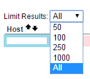

# Nagios_Tips
---
## 目的
收錄操作過程中瑣碎的設定與內容，並附上參考文獻。

## Tip1	修改 Limit Results
##### 敘述
修改 Nagios Web 單一頁面呈現的資料筆數。
##### 操作
在 cgi.cfg 設定檔修改內容
```bash
[root@NagiosServer ~]# vim /etc/nagios3/cgi.cfg
...
# DEFAULT PAGE LIMIT
# This option allows you to specify the default number of results
# displayed on the status.cgi.  This number can be adjusted from
# within the UI after the initial page load. Setting this to 0
# will show all results.

result_limit=0
```
##### 呈現結果
預設值改為 All，顯示所有資料。

##### 參考文獻
[Nagios and Nagios Related Information－NRPE](http://sites.box293.com/nagios/guides/nrpe/proxying-or-double-hopping/nrpe)
