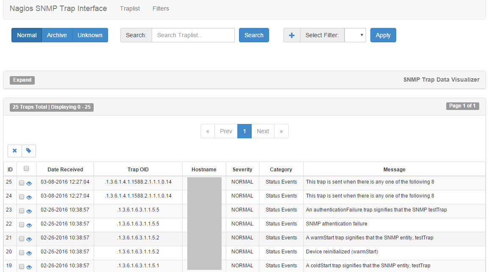
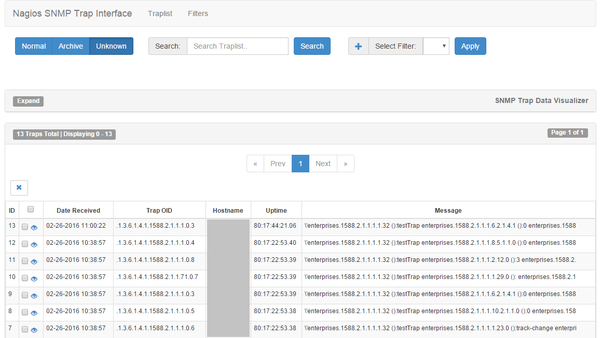

# Nagios SNMP Trap Interface Advance Note
---

## 目的
透過此篇文章，您可以學到以下內容：
* 解決 snmpttconvertmib 轉換 MIB 檔為 SNMPTT 可讀取的設定檔過程出現的錯誤

## 參考文獻
[Github－NSTI 3.0](https://github.com/NagiosEnterprises/nsti)
[NSTI 3.0 Document](https://nagiosenterprises.github.io/nsti/index.html)


## 版本資訊
* Nagios：Nagios Core 3.5.1
* Nagios Server OS：CentOS 6.7
* NSTI Package：NSTI 3.0.2

## 問題需求
snmpttconvertmib 轉換 MIB 檔為 SNMPTT 可讀取的設定檔過程出現錯誤，造成大部分 SNMP Trap 無法成功轉換，snmpttconvertmib轉換方法請參考[Nagios_SNMP_Trap_Interface_Note.md](https://github.com/colorbook/nagios_tips/blob/master/note/Nagios_SNMP_Trap_Interface_Note.md#nagios-server-端snmp-srver)。因設備提供多個必須的 SNMP Trap MIB 檔，在 snmpttconvertmib 轉換過程分別讀取這些 MIB 檔，但 MIB 檔之間具有 IMPORT 參考關係，造成 snmpttconvertmib 轉換過程出現找不到 IMPORT Module 的錯誤訊息，導致轉換失敗。

## 解決方法概念
因 MIB 檔之間有 IMPORT 參考關係，因此將所有 MIB 檔合併成單一檔案，snmpttconvertmib 轉換過程在單一檔案內部即可找到參考資訊。

## 解決方法細節
### Nagios Server 端(SNMP Srver)
1. 待轉換的 MIB 檔
	傳送SNMP Trap 設備為 HP SAN Switch，該設備提供 SNMP Trap MIB 檔如下所示。
    ```bash
    [root@NagiosServer ~]# ls mib_dir
    bcCustomOperation.mib
	bd.mib
	brcdfcip.mib
	BRCD_REG.mib
	BRCD_TC.mib
	BROCADE-MAPS-MIB.mib
	CPQ_HOST.mib
	CPQ_RACK.mib
	faext.mib
	FA.mib
	FICON.mib
	fod.mib
	HA.mib
	IbmBladeCenter.mib
	SW.mib
    ```

2. 轉換過程出現錯誤訊息
	snmpttconvertmib 轉換過程出現找不到 IMPORT Module 錯誤訊息，導致轉換失敗。
    ```bash
    [root@NagiosServer ~]# for i in where/your/nsti_dir/* ;
    do
    snmpttconvertmib --in=$i --out=/etc/snmp/hp_san_switch.conf
    done
    ```
    錯誤訊息如下所示(節錄)
    ```bash
    ...
    Line: 3448
	TRAP-TYPE: cpqRackPowerSupplyInserted
	Variables: sysName cpqHoTrapFlags cpqRackName cpqRackUid
	Looking up via snmptranslate: CPQRACK-MIB::cpqRackPowerSupplyInserted
	Cannot find module (Brocade-REG-MIB): At line 8 in Brocade-REG-MIB.mib
	Did not find 'fcSwitch' in module #-1 (Brocade-REG-MIB.mib)
	Unlinked OID in BCCUSTOM-OPR-MIB: bcCustomOperation ::= { fcSwitch 52 }
	Undefined identifier: fcSwitch near line 10 of Brocade-REG-MIB.mib
	Cannot find module (Brocade-TC): At line 134 in Brocade-REG-MIB.mib
	Cannot find module (Brocade-REG-MIB): At line 137 in Brocade-REG-MIB.mib
	Cannot find module (SW-MIB): At line 140 in Brocade-REG-MIB.mib
	Did not find 'SwPortIndex' in module #-1 (Brocade-REG-MIB.mib)
	Did not find 'fcSwitch' in module #-1 (Brocade-REG-MIB.mib)
	Did not find 'bcsiModules' in module #-1 (Brocade-REG-MIB.mib)
	Did not find 'swVfId' in module #-1 (Brocade-REG-MIB.mib)
    ...
    #
	Line: 3558
	TRAP-TYPE: cpqRackPowerChassisConfigError
	Variables: sysName cpqHoTrapFlags cpqRackName cpqRackUid
	Looking up via snmptranslate: CPQRACK-MIB::cpqRackPowerChassisConfigError
	OID:
	
	Done
	
	Total translations:        36
	Successful translations:   0
	Failed translations:       36
    ```
    上述錯誤訊息顯示 MIB 檔轉換過程無法找到參考模組(Cannot find module)，造成 SNMP Trap 轉換失敗，因此設備傳送至 SNMP Server 的 SNMP Trap 記錄會無法解析 OID 含意，如下所示。
    ```bash
    [root@NagiosServer ~]# tail -f /var/log/messages
    ...
    Feb 28 10:00:00 NagiosServer snmptrapd[3333]: 2016-02-28 10:00:00 10.1.1.2(via UDP: [10.1.1.2]:43567->[10.1.1.10]) TRAP, SNMP v1, community public#012#011.1.3.6.1.3.94 Enterprise Specific Trap (4) Uptime: 10 days, 22:00:00.03#012#011.1.3.6.1.4.1.1588.2.1.1.1.1.32 = STRING: "testTrap"#011.1.3.6.1.3.94.1.11.1.3.16.0.80.235.26.216.142.153.0.0.0.0.0.0.0.0.0 = INTEGER: 0#011.1.3.6.1.3.94.1.11.1.7.16.0.80.235.26.216.142.153.0.0.0.0.0.0.0.0.0 = INTEGER: 2#011.1.3.6.1.3.94.1.11.1.8.16.0.80.235.26.216.142.153.0.0.0.0.0.0.0.0.0 = OID: .0.0#011.1.3.6.1.3.94.1.11.1.9.16.0.80.235.26.216.142.153.0.0.0.0.0.0.0.0.0 = STRING: " "
    ```
    
3. 推測可能問題
	分析各 MIB 檔，在轉換 SNMP Trap 規則時會參考其他 MIB MODULE-IDENTITY，如下所示。
    ```bash
    [root@NagiosServer ~]# cat BRCD_TC.mib
    ...
	Brocade-TC DEFINITIONS ::= BEGIN
    	IMPORTS
        	bcsiModules
      	FROM Brocade-REG-MIB
        	TEXTUAL-CONVENTION
      	FROM SNMPv2-TC
        	Integer32, MODULE-IDENTITY
      	FROM SNMPv2-SMI;

  		bcsiModuleTC MODULE-IDENTITY
    		LAST-UPDATED "200301131430Z"
    		ORGANIZATION "Brocade Communications Systems, Inc.,"
	...
    ```
    上述 MIB 檔內容會先從其他 MIB 檔 IMPORT 參考的 MODULE-IDENTITY，因此推測各 MIB 檔之間具有 IMPORT 參考關係，snmpttconvertmib 轉換過程出現找不到 IMPORT Module 的錯誤訊息，因為單一 MIB 黨內無參考的MODULE-IDENTITY，導致轉換失敗。
    
4. 合併 MIB 檔
	嘗試將各 MIB 檔合併成單一 MIB 檔，因此所有參考資雲接在該檔案內。
    ```bash
    [root@NagiosServer ~]# cat /where/mib_dir/* >> all_mib_file.mib
    ```
5. 轉換成功
	刪除先前轉換失敗設定檔，重新執行 snmpttconvertmib 轉換。
    ```bash
    [root@NagiosServer ~]# rm /etc/snmp/hp_san_switch.conf
    [root@NagiosServer ~]# snmpttconvertmib --in=all_mib_file.mib --out=/etc/snmp/hp_san_switch.conf
    ...
	Total translations:        83
	Successful translations:   83
	Failed translations:       0
    ```

6. NSTI 顯示內容
	正常 NSTI 顯示資訊內容(Normal)
    
    
    NSTI 無法解析 OID 顯示資訊內容(Unknown)
    

### 監控設備端
1. 手動測試
    利用 snmptrap 工具測試能否將 SNMP Trap 傳送至 SNMP Server，snmptrap 用法請參考 [snmptrap command](http://linuxcommand.org/man_pages/snmptrap1.html)。
    ```bash
    [root@TestServer ~]# snmptrap -v 2c -c public 10.3.76.123 "" NET-SNMP-EXAMPLES-MIB::netSnmpExampleHeartbeatNotification netSnmpExampleHeartbeatRate i 123456
    ```
    在 SNMP Server /var/log/messages 查看是否有收到 SNMP Trap 資料
    ```bash
    [root@NagiosServer ~]# tail -f /var/log/messages
    ...
    Jan 20 08:05:42 NagiosServer snmptrapd[6374]: 2016-01-20 02:06:42 <UNKNOWN> [UDP: [10.3.76.123]:59307->[10.3.76.123]]:#012.1.3.6.1.2.1.1.3.0 = Timeticks: (2017719) 5:36:17.19#011.1.3.6.1.6.3.1.1.4.1.0 = OID: .1.3.6.1.4.1.8072.2.3.0.1#011.1.3.6.1.4.1.8072.2.3.2.1 = INTEGER: 123456
    ```
    此外，開啟 NSTI WebUI 確認是否有資料存取。
