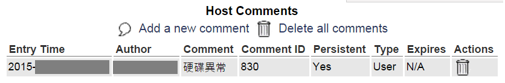

# Resolve Nagios is Currently Not Checking for External Commands.

---

## 目的
透過此篇文章，您可以學到以下內容：
* 透過權限設定，解決 Nagios Web無法評論(comment)問題。

## 參考文獻
[Fix to Nagios is currently not checking for external commands](http://pc-freak.net/blog/fix-to-nagios-is-currently-not-checking-for-external-commands/)
[Enabling External Commands in Nagios / Ubuntu](http://www.barryodonovan.com/2013/06/20/enabling-external-commands-in-nagios-ubuntu)

## 版本資訊
* Nagios：Nagios Core 3.5.1
* Nagios Server OS：Debian 7

## 問題需求
Nagios Web 提供針對各監測對象做評論的功能，但預設並沒有開啟此功能。
錯誤訊息為：Sorry, but Nagios is currently not checking for external commands, so your command will not be committed! Read the documentation for information on how to enable external commands...

## 解決方法概念
1. 修改設定檔參數
2. 設定評論檔資料夾權限

## 解決方法細節

#### 修改設定檔參數
```bash
[root@NagiosServer ~]# vim /etc/nagios3/nagios.cfg
...
# EXTERNAL COMMAND OPTION
# This option allows you to specify whether or not Nagios should check
# for external commands (in the command file defined below).  By default
# Nagios will *not* check for external commands, just to be on the
# cautious side.  If you want to be able to use the CGI command interface
# you will have to enable this.
# Values: 0 = disable commands, 1 = enable commands

check_external_commands=1
```

#### 設定評論檔資料夾權限
```bash
[root@NagiosServer ~]# chown nagios:www-data /var/lib/nagios3/rw
[root@NagiosServer ~]# chmod 2710 /var/lib/nagios3/rw
[root@NagiosServer ~]# chown nagios:nagios /var/lib/nagios3
[root@NagiosServer ~]# chmod 751 /var/lib/nagios3
```

#### 結果呈現
成功評論監控對象

