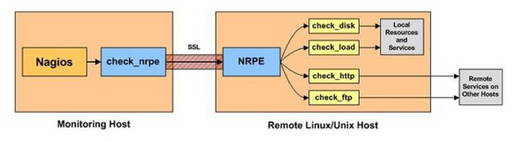

# Setting Nagios Client Proxy on CentOS7
---
## 目的
透過此篇文章，您可以學到以下內容：
* 利用 NRPE (Nagios Remote Plugin Executor) 做為 Nagios Client。
* 利用 Nagios Client 做為 proxy，藉此對遠端設備(Nagios Server無法接觸到)做查詢，並回傳給 Nagios Server。

## 參考文獻
[Nagios and Nagios Related Information－NRPE](http://sites.box293.com/nagios/guides/nrpe/proxying-or-double-hopping/nrpe)

## 問題需求
因在監控設備狀態時，我們在某一組架構遇到以下困難，使得無法透過 Nagios Server 去監控整組設備，其簡要架構如下：

```
+--------+     +--------+    +--------+
| Nagios |     | Proxy  |    | Remote |
| Ser^er +-----+ Client +----+ Client |
+--------+     +--------+    +--------+
         Public         Pri^ate
```

從上圖可以了解，Nagios Server 可透過 Public IP 對 Proxy Client 做查詢，但是對 Remote Client 卻無法，因為 Remote Client 為 Private IP，Nagiso Server 無法觸及 Remote Client。

## 解決方法概念
因 Nagios Server 無法觸及 Remote Client，故無法直接對其做查詢。因此我們希望透過 Proxy Client 做為中介者的角色(Proxy)，透過 Proxy Client 對 Remote Client 做查詢再將資料回傳至 Nagios Server。在 NRPE 這模組中，具有支援 Proxy 的解法，而此方法在官網中稱為間接查詢(Indirect Check)，詳細如下圖(截自官網)：


## 解決方法細節

### Remote Client 端
1. 安裝相關套件
    ```bash
    [root@RemoteClient ~]# yum install -y epel-release.noarch   #安裝 epel 第三方 reponsitiory ，因為很多 nagios plugin 只有第三方才有釋出。
    [root@RemoteClient ~]# yum update   #更新 yum 套件清單
    [root@RemoteClient ~]# yum install openssl nrpe nagios-plugin*  #安裝 openssl 因為 nrpe 查詢過程或使用SSL
    ```

2. nrpe.cfg 設定
    編輯NREP設定檔
    ```bash
    [root@RemoteClient ~]# vim /etc/nagios/nrpe.cfg
    ...
    allowed_hosts=127.0.0.1, 10.3.76.69 #設定允許 IP 為 127.0.0.1 與 10.3.76.69 (為 Honeywall IP)
    ```

3. 服務重啟
    ```bash
    [root@RemoteClient ~]# systemctl enable nrpe.service    #設定開機啟動
    [root@RemoteClient ~]# systemctl restart nrpe.service   #設定重啟服務
    ```

4. 確認設定狀況
    ```bash
    [root@RemoteClient ~]# /usr/lib64/nagios/plugins/check_nrpe -H 127.0.0.1    #測試服務是否正常
    NRPE v2.15
    [root@RemoteClient ~]# /usr/lib64/nagios/plugins/check_nrpe -H 127.0.0.1 -c check_users #測試相關查詢內容
    USERS OK - 3 users currently logged in |users=3;5;10;0
    ```

### Proxy Client 端
1. 安裝相關套件
    ```bash
    [root@ProxyClient ~]# yum install -y epel-release.noarch    #安裝 epel 第三方 reponsitiory ，因為很多 nagios plugin 只有第三方才有釋出。
    [root@ProxyClient ~]# yum update    #更新 yum 套件清單
    [root@ProxyClient ~]# yum install openssl nrpe nagios-plugin*   #安裝 openssl 因為 nrpe 查詢過程或使用SSL
    ```

2. nrpe.cfg 設定
    編輯NREP設定檔
    ```bash
    [root@HProxyClient ~]# vim /etc/nagios/nrpe.cfg
    ...
    allowed_hosts=127.0.0.1, 10.3.76.65 #設定允許 IP 為 127.0.0.1 與 10.3.76.65 (為 Nagios Server)
    command[proxy_check]=/usr/lib64/nagios/plugins/check_nrpe -t 60 -H 10.3.76.71 -c check_users    #自定義 command，綁定讀取 PotVM 並由 PotVM 本地執行 check_users 指令，將結果回傳，並且設定最大等待時間為 60 秒。
    ```

3. 服務重啟
    ```bash
    [root@ProxyClient ~]# systemctl enable nrpe.service #設定開機啟動
    [root@ProxyClient ~]# systemctl restart nrpe.service    #設定重啟服務
    ```

4. 確認設定狀況
    ```bash
    [root@ProxyClient ~]# /usr/lib64/nagios/plugins/check_nrpe -H 127.0.0.1 #測試服務是否正常
    NRPE v2.15
    [root@ProxyClient ~]# /usr/lib64/nagios/plugins/check_nrpe -H 127.0.0.1 -c check_users  #測試相關查詢內容
    USERS OK - 3 users currently logged in |users=3;5;10;0
    [root@ProxyClient ~]# /usr/lib64/nagios/plugins/check_nrpe -H 10.3.76.71    #測試 PotVM 連線是否正常
    NRPE v2.15
    [root@ProxyClient ~]# /usr/lib64/nagios/plugins/check_nrpe -H 10.3.76.71 /usr/lib64/nagios/plugins/check_nrpe -H 10.3.76.71 -c check_load   #測試系統負載命令
OK - load average: 0.00, 0.01, 0.05|load1=0.000;15.000;30.000;0; load5=0.010;10.000;25.000;0; load15=0.050;5.000;20.000;0;
    ```

### Nagios Server 端
1. 測試 Honeywall 是否 proxy 成功
    ```bash
    [root@NagiosServer ~]# /usr/local/nagios/libexec/check_nrpe -H 10.3.76.69 -c proxy_check
    USERS OK - 3 users currently logged in |users=3;5;10;0
    ```
