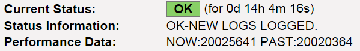

# Setup Nagios Plugin of Shell Script
---

## 目的
透過此篇文章，您可以學到以下內容：
* 撰寫 Shell Scripts Nagios Plugin 的兩個準則
* 在 Nagios Server 端設定 Nagios Plugin 的步驟

## 參考文獻
[Nagios Core－Nagios Plugin API](https://assets.nagios.com/downloads/nagioscore/docs/nagioscore/3/en/pluginapi.html)
[Running a nagios plugin as root](http://your-linux-how-tos.blogspot.tw/2012/11/running-nagios-plugin-as-root.html)

## 版本資訊
* Nagios：Nagios Core 3.5.1
* Nagios Server OS：Debian 7

## 問題需求
透過 Nagios 官方或第三方所開發的 Plugins，我們可以有效的監控所需標的，但還是可能會沒有合適的 Plugin 供我們使用，這時我們就必須自行撰寫 Plugin。如何撰寫 Plugin 以及如何設定 Nagios 使其有效執行 Plugin 會是我們必定會遇到的課題。

## 解決方法概念
Nagios 支援多種程式語言撰寫 Plugin，本篇使用 Shell Script 撰寫，並且在 Nagios Server 設定執行此 Shell Script。根據 [Running a nagios plugin as root](http://your-linux-how-tos.blogspot.tw/2012/11/running-nagios-plugin-as-root.html) 這篇文章提到有三種設定方式執行 Nagios Plugin，分別為(1)在 Nagios Server 端執行 (2)在 Nagios Client 端 nrpe.cfg 設定檔做設定 (3)在 Nagios Client 端給予 nagios 使用者 sudo 權限。本篇為了集中管理 Shell Script，所以選擇在 Nagios Server 端執行。

## 解決方法細節

### Shell Script 撰寫
以下 Shell Script 內容為監測 Nagios Client 防火牆是否持續運作並做記錄：
    ```bash
    #!/bin/bash

    host_ip=$1                          # Nagios Client IP
    log_num_file='/var/log/NUM_OF.log'  # File saving past number of firewall log
    num_no_log=0
    num_nowlogs=$(sudo ssh root@$host_ip "grep iptables /var/log/messages| wc -l")
    num_pastlogs=$(sudo ssh root@$host_ip "cat $log_num_file")

    if [ $num_nowlogs == $num_no_log ]; then
        echo "CRITICAL-HAVENT GOT ANY LOG TODAY.| NOW:$num_nowlogs PAST:$num_pastlogs"
        sudo ssh root@$host_ip "echo $num_nowlogs > $log_num_file"
        exit 2

    elif [ $num_nowlogs -eq $num_pastlogs ]; then
        echo "WARNING-NO LOGS DURING CHECK POINTS.| NOW:$num_nowlogs PAST:$num_pastlogs"
        sudo ssh root@$host_ip "echo $num_nowlogs > $log_num_file"
        exit 1

    elif [ $num_nowlogs -gt $num_pastlogs ]; then
        echo "OK-NEW LOGS LOGGED.| NOW:$num_nowlogs PAST:$num_pastlogs"
        sudo ssh root@$host_ip "echo $num_nowlogs > $log_num_file"
        exit 0

    else
        echo "UNKNOWN-SOMETHING WRONG.| NOW:$num_nowlogs PAST:$num_pastlogs"
        sudo ssh root@$host_ip "echo $num_nowlogs > $log_num_file"
        exit 3
    fi
    ```
根據 Nagios 官方 [Nagios Core－Nagios Plugin API](https://assets.nagios.com/downloads/nagioscore/docs/nagioscore/3/en/pluginapi.html) 說明文件提到，撰寫 Plugin 有兩項準則須遵守：

    1. Plugin 回傳值決定 Nagios State (監控服務的狀態分為：OK, WARNING, CRITICAL, UNKNOWN)，以下為對應表(參考於 Nagios 官網)：

| Plugin Return Code  | Service State  | Host State  |
|:-:|:-:|:-:|
| 0  | OK  | UP  |
| 1  | WARNING  | UP or DOWN/UNRESEARCHABLE  |
| 2  | CRITICAL  | DOWN/UNRESEARCHABLE  |
| 3  | UNKNOWN  | DOWN/UNRESEARCHABLE  |

    2. 至少要回應一行文字做為監控輸出訊息，詳細說明可參考官網文件。

### Nagios Server 端設定
1. 設定 Nagios Plugin 指令
    ```bash
    [root@NagiosServer ~]# vim /etc/nagios3/commands.cfg
    ...
    # Check client firewall log status
    define command{
        command_name    check_firewalllog
        command_line    /usr/lib/nagios/plugins/check_firewalllog.sh $HOSTADDRESS$
        }
    ```

2. 設定 Nagios 監控服務設定檔
    ```bash
    [root@NagiosServer ~]# /etc/nagios3/conf.d/NagiosClient.cfg
    ...
    define service{
        use                     generic-service
        host_name               NagiosClient
        service_description     Firewall Log
        check_command           check_firewalllog
        }
    ```

3. **(重要)設定 Nagios 使用者免密碼登入 Nagios Client**
    事先建立 Nagios Client 免密碼登入，因此才能就在監控過程不會因需輸入帳密而造成監控失敗。
    ```bash
    [root@NagiosServer ~]# ssh-copy-id root@NagiosClientIP
    root@NagiosClientIP's password: *******
    Now try logging into the machine, with "ssh 'root@NagiosClientIP'", and check in:       ~/.ssh/authorized_keys
    to make sure we haven't added extra keys that you weren't expecting.
    ```

4. **(重要)設定 /etc/sudoer 允許 Nagios 使用者免 sudo 密碼使用特定指令**
    上述步驟所建立免密碼登入的使用者為 root，因此賦予 nagios 使用者 root 權限但只限於使用 ssh 指令。此外，Nagios 在執行 Plugin 過程中可能會使用特定使用者身分才能執行的指令，這樣的限制可能會造成 Nagios Plugin 監控效果不如預期，因此也必需在 /etc/sudoer 設定檔中一併設定 nagios 的執行身分或指令權限。
    ```bash
    [root@NagiosServer ~]# vim /etc/sudoer
    ...
    nagios  NagiosServer=(ALL) NOPASSWD:/usr/bin/ssh
    ```
5. 執行結果
    
